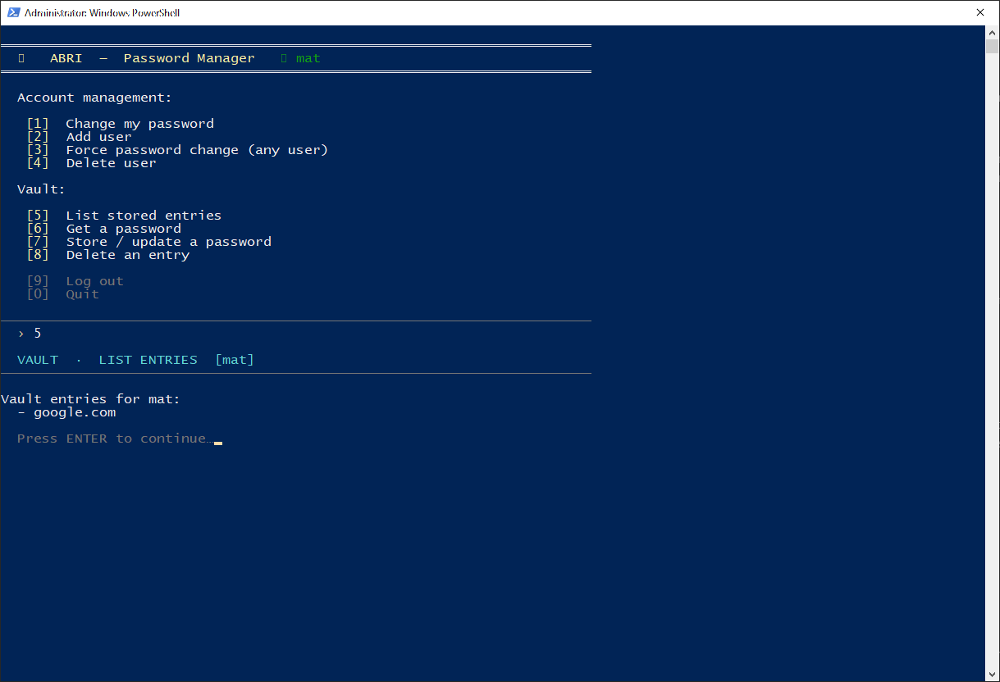
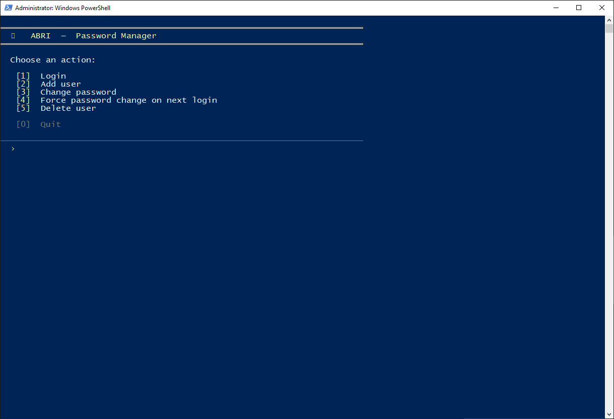

# ABRI - CLI password manager



## Purpose

ABRI is a completely local, multi-user, CLI password management application. It combines user account management, and an encrypted credential vault. It evolved from two previous projects:

- L1: encrypted password storage protected by a master password
- L2: multi-user account management with password hashing, password aging and forced password changes
- L3 (ABRI): combines both systems into a single application, and adds per-user encrypted vaults together with an interactive terminal interface

Implemented in Python using:

- `pycryptodome`
     - key derivation from the user master-password
     - cryptographic random number generation and hashing
     - AES-GCM authenticated encryption for vault protection
- base64 encoding and `jsonpickle` serialization of account objects for persistant local storage
- `getpass` for hidden password entry

Security features:

- Secure local storage:
     - **padding**, to prevent length extension attacks
     - once-generated **salt** used to avoid consistent hashes
     - per-transaction-generated **nonce** to prevent replay attacks, in case access to files is intercepted
     - only the nonce, tag, salt and the **scrypt(pass, salt) KDF** (salted, password-derived cryptographic hashes) are stored, actual passwords never touch the disk.
- Passwords:
     - Password **complexity enforcement** (minimum length and complexity)
     - Password **reuse prevention** during password changes
     - Periodic password **expiration** and **forced password rotation**
     - **Hidden password input** through terminal-safe prompts
- Vault protection:
     - Per-user **AES-GCM** authenticated&encrypted password vaults
     - **Authentication tag** verification that detects vault tampering or corruption
     - Automatic vault re-encryption whenever a user's login password changes
     - Complete vault removal when a user account is deleted
     - **Information mining prevention** by not specifying whether entered username or password is incorrect

Prevention of password guessing (repeated input delay) and mid-air protection are not implemented, since the application can only be accessed localy, by trusted users, and passwords are not transmitted over the network.

## Storage format

ABRI stores account aministration data and vault data separately.

The account administration database

`storage.txt` - contains serialized user records consisting of the master password KDF, forced-password-change flag and password creation timestamp

```json
{
    "<user>": {
        "pwdHash": "...",
        "changeFlag": false,
        "setDate": "..."
    }
}
```

Then, for each user, AES-GCM encrypted vault and parameters are created:

`vault_<user>.bin` - The encrypted binary containing a serialized dictionary of:

```json
{
    "<service-address>": "<base64-encoded padded KDF>"
}
```

`vault_<user>_params.json` - Randomly generated cryptographic salt, authentication tag, and transaction nonce

```json
{ 
    "salt": "...",
    "nonce": "...",
    "tag": "..."
}
```

The AES encryption key is derived directly from the user's login password using scrypt, so no additional master keys need to be stored or managed.

## Configuration

ABRI takes the "Safe defaults" approach, enabling all protections and setting conservative parameters by default, while allowing advanced user to tweak settings at their own risk. Configuration variables can be found at the top of the script:

```py
_force_password_complexity = True  # Default =True; WARNING: setting this to =False is not recommended!
_minimim_pwd_len = 8               # Default =8, min =1, max =_max_input_len-1
_max_input_len = 256               # Default =256, min =2
_max_pwdAge_days = 31              # Default =31, min =1, max =inf
```

## Installation and usage

ABRI depends on `pycryptodome` and `jsonpickle`. After cloning the repo, you might position a powershell instance at the root, then create a virtual environment with the dependencies:

```powershell
\abri> Set-ExecutionPolicy -ExecutionPolicy RemoteSigned -Scope CurrentUser    # powershell does not allow script execution by default
\abri> .\venv\Scripts\Activate.ps1
\abri> pip install pycryptodome
\abri> pip install jsonpickle

# later, to exit the virtual environemnt
\abri> deactivate
```

Run the terminal interface:

```powershell
\abri> python ui.py
```

When started through `ui.py`, ABRI provides a context-sensitive terminal interface.

1. Admin account management
   
      1. `Login`
            1. Authenticates a user
            2. Displays a green session badge after successful login
      2. `Add user`
            1. Creates a new account protected by a scrypt-derived password hash
      3. `Change password`
            1. Updates the account password
            2. Automatically re-encrypts the user's vault
      4. `Force password change`
            1. Requires a user to choose a new password at the next successful login
      5. `Delete user`
            1. Removes the account and all associated vault files

2. Vault operations (available after user login)
   
      1. `List entries`
            1. Displays all stored service names
      2. `Get password`
            1. Retrieves a stored credential
      3. `Store / update password`
            1. Creates or updates an entry
            2. Automatically creates the encrypted vault on first use
      4. `Delete entry`
            1. Removes a stored credential
      5. `Log out`
            1. Clears the in-memory session state

Alternatively, the `ul3.py` stateless command-line backend can be used directly:

```powershell
\abri> python ul3.py
    usermgmt 
        add <user>          # initial (or after loss of integrity) user setup; requires entering password twice
        psswd <user>        # changing user's password; requires entering password twice
        forcepass <user>    # user will be prompted to change their password after next login
        del <user>          # delete user and their vault

        login <user>        # login with master password
                            # vault commands available only after login
    vault 
        list <user>               # list user's saved accounts
        put <user> <account>      # add new account
        get <user> <account>      # get the saved login for an existing account
        del <user> <account>      # remove account from vault
```
